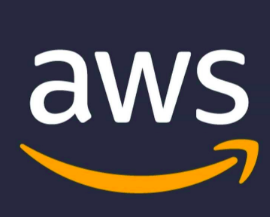
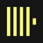
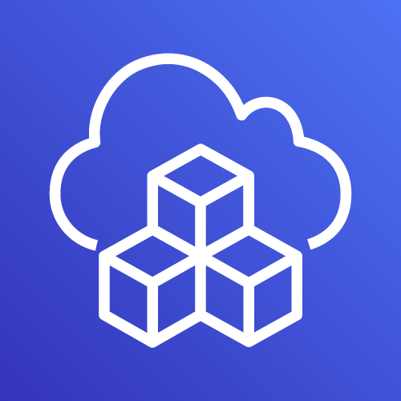
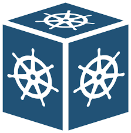

<h1 align="center">Hi 👋, I'm Vu Dao </h1>
<h2 align="center"><b>🚀 AWS Well-Architected | DevOps | AWS Community Builder 🚀</b></h2>

---

     

- 🔭 **Senior Devops Engineer**

- 📝 I regularly write articles on [dev.to](https://dev.to/vumdao)

- 💬 Ask me about **AWS, CDK, CDK8S, Vcluster, K8S**

- 📄 Know about my experiences on [Linkedin](https://www.linkedin.com/in/vu-dao-9280ab43/)

---

<h2 align="left"><b>Connect with me:</b></h2>

    
    
    
    
    

---

<h2>🚀 Tools/ Technologies/ What I use/used</h2>

        <a href="https://www.python.org/" target="_blank">       </a>                  

 

---

## :octocat: [AMA - Ask Me Anything](https://github.com/vumdao/vumdao/discussions/categories/ama-ask-me-anything)

---

## Latest published on [Dev.to](https://dev.to/vumdao)
<!-- DEVTO_LIST:START -->
- [Multi-Tenancy In EKS Cluster Using Vcluster](https://dev.to/aws-builders/multi-tenancy-in-eks-cluster-using-vcluster-2pni)
- [Single-Sign-On By Vouch Proxy And AWS Cognito](https://dev.to/aws-builders/single-sign-on-by-vouch-proxy-and-aws-cognito-427g)
- [FastApi With AWS Serverless powered by CDK Typescript](https://dev.to/aws-builders/fastapi-with-aws-serverless-powered-by-cdk-typescript-58a1)
- [Amazon ECS Farget with Blue-Green Deployments by CDK Typescript - Part 2](https://dev.to/aws-builders/amazon-ecs-farget-with-blue-green-deployments-by-cdk-typescript-part-2-19f1)
- [Hands-on Amazon ECS for Blue-Green Deployments With CDK Typescript - Part 1](https://dev.to/aws-builders/hands-on-amazon-ecs-for-blue-green-deployments-with-cdk-typescript-part-1-4ie3)
- [Manage IAM Access Key Of AWS Service Connection In Azure DevOps Pipeline](https://dev.to/aws-builders/manage-iam-access-key-of-aws-service-connection-in-azure-devops-pipeline-481k)
- [CDK CloudWatch Auto Alarms](https://dev.to/aws-builders/cdk-cloudwatch-auto-alarms-539p)
- [Run event-driven workflows with Amazon EKS Blueprints, Keda and Karpenter](https://dev.to/aws-builders/run-event-driven-workflows-with-amazon-eks-blueprints-keda-and-karpenter-160a)
- [CDK Typescript Pipeline Workshop](https://dev.to/aws-builders/cdk-typescript-pipeline-workshop-4j64)
- [Kyverno Policy As Code Using CDK8S](https://dev.to/aws-builders/kyverno-policy-as-code-using-cdk8s-3ibe)
<!-- DEVTO_LIST:END -->

---

## 📈 GitHub Stats  

---

<a target="_blank" rel="noopener noreferrer">
  
  
   
</a>
 

  

